<div align="center">

# 👋 Hi, I'm Fernando Ramos


**Building scalable systems with modern infrastructure and AI-powered workflows**

[](https://linkedin.com/in/fernando-ramos-654514262)
[](https://foliox.site/luci-efe)
[](mailto:lramirez.ramos@iteso.mx)


</div>

---

## 🚀 About Me

```typescript
const fernando = {
    location: "Guadalajara, Mexico 🇲🇽",
    education: "ITESO - Computer Systems Engineering",
    graduation: "December 2026",
    currentRole: "Information Security Analyst @ Eternal Data",
    previousRole: "AI Systems Developer & Technical PM @ TendencIA",
    
    passion: [
        "Building scalable cloud infrastructure",
        "Designing real-time data pipelines",
        "AI-augmented development workflows",
        "Infrastructure as Code"
    ],
    
    differentiator: "Combining deep technical skills with project management " +
                    "experience using OpenSpec & SpecKit frameworks"
};
```

🎯 **What I Do:** After leading AI development teams, I discovered my true calling in hands-on engineering—building the systems that power innovation.

🌟 **What Sets Me Apart:** I specialize in **AI-augmented development workflows** using OpenSpec and SpecKit, enabling 30% reduction in scope creep and seamless team collaboration.

---

## 🛠️ Tech Stack & Skills

<div align="center">

### Languages & Core Technologies


### DevOps & Cloud


### Data Engineering


### Frameworks & Tools


### AI & Automation


</div>

<details>
<summary><b>📊 Detailed Tech Stack (Click to expand)</b></summary>

```yaml
devops_and_cloud:
  iac: [Terraform, Azure, AWS]
  cicd: [Azure DevOps, GitHub Actions]
  containers: [Docker, multi-stage builds]
  monitoring: [Application Insights, distributed tracing]

data_engineering:
  streaming: [Apache Kafka, Spark Structured Streaming]
  databases: [PostgreSQL, Prisma ORM]
  pipelines: [ETL architecture, real-time processing]
  ml: [scikit-learn, Random Forest, data preprocessing]

development:
  languages: [TypeScript, Python, JavaScript, SQL]
  frameworks: [Next.js 14, Node.js, Express, React]
  testing: [Jest, Playwright, 70%+ coverage standards]
  auth_payments: [Clerk, Stripe]

ai_systems:
  apis: [OpenAI, Anthropic Claude, Google AI]
  frameworks: [OpenSpec, SpecKit, n8n]
  applications: [RAG, Vector Search, Chatbots/Voicebots]
  production_scale: [500+ calls/month, 60% ops scaling]
```

</details>

---

## 🏆 Featured Projects

<table>
<tr>
<td width="50%">

### 🛒 [ReparaYa](https://github.com/luci-efe/ReparaYa)
[](https://github.com/luci-efe/ReparaYa)
[](https://github.com/luci-efe/ReparaYa)
[](https://github.com/luci-efe/ReparaYa)

**Full-stack Marketplace Platform**

Service marketplace connecting clients with contractors

🔹 3-layer modular architecture (9 domains)  
🔹 >70% test coverage (Jest + Playwright)  
🔹 Terraform IaC for AWS resources  
🔹 OpenSpec-driven development  
🔹 CI/CD with GitHub Actions  

[🔗 Live Demo](https://repara-ya-mu.vercel.app) • [📖 Docs](https://github.com/luci-efe/ReparaYa)

</td>
<td width="50%">

### ⚙️ [LifeSync](https://github.com/luci-efe/lifesync)
[](https://github.com/luci-efe/lifesync)
[](https://github.com/luci-efe/lifesync)
[](https://github.com/luci-efe/lifesync)

**Complete DevOps Lifecycle**

Personal organization app showcasing DevOps best practices

🔹 Terraform IaC (Azure infrastructure)  
🔹 Azure DevOps pipelines  
🔹 Docker containerization  
🔹 Application Insights monitoring  
🔹 Dev/Prod environments  

[📖 Docs](https://github.com/luci-efe/lifesync)

</td>
</tr>

<tr>
<td width="50%">

### 📊 [Big Data Pipelines](https://github.com/pcamarillor/O2025_ESI3914O/pull/149)
[](https://github.com/pcamarillor/O2025_ESI3914O/pull/149)
[](https://github.com/pcamarillor/O2025_ESI3914O/pull/149)
[](https://github.com/pcamarillor/O2025_ESI3914O/pull/149)

**Streaming & ML Pipelines**

Real-time data processing and ML classification

🔹 Kafka + Spark Structured Streaming  
🔹 Random Forest ML pipeline  
🔹 Time-based Parquet partitioning  
🔹 IoT sensor data processing  
🔹 End-to-end ML workflow  

[📖 View PR](https://github.com/pcamarillor/O2025_ESI3914O/pull/149)

</td>
<td width="50%">

### 🤖 AI Systems Portfolio
[](https://github.com/luci-efe)
[](https://github.com/luci-efe)

**Production AI Automation**

Conversational AI systems at scale

🔹 6 production voicebots (500+ calls/month)  
🔹 60% operational scaling achieved  
🔹 RAG & Vector Search engines  
🔹 OpenAI + Anthropic integration  
🔹 Real estate chatbot systems  

*Work experience at TendencIA*

</td>
</tr>
</table>

---

## 🎯 AI-Augmented Development Expertise

<div align="center">

### 🚀 OpenSpec & SpecKit Frameworks

```mermaid
graph LR
    A[📐 Define Specs] --> B[🤖 AI Collaboration]
    B --> C[👥 Team Alignment]
    C --> D[🔍 Code Review]
    D --> E[✅ Quality Delivery]
    
    style A fill:#6A5ACD,stroke:#333,stroke-width:2px,color:#fff
    style B fill:#00C853,stroke:#333,stroke-width:2px,color:#fff
    style C fill:#2196F3,stroke:#333,stroke-width:2px,color:#fff
    style D fill:#FF9800,stroke:#333,stroke-width:2px,color:#fff
    style E fill:#4CAF50,stroke:#333,stroke-width:2px,color:#fff
```


</div>



**What This Means:**
- 📐 **Spec-driven development**: Define architecture and contracts before implementation
- 🤖 **AI collaboration**: Structured context for Claude Code, GitHub Copilot, and other AI tools
- 👥 **Team alignment**: Clear specifications reduce miscommunication and rework
- 🔍 **Automated consistency**: CodeRabbit integration for quality checks

**Real Impact:** ReparaYa's `/openspec/` folder contains complete architectural specs enabling seamless AI-assisted development across an 8-person team.

---

## 💼 Professional Experience

<details open>
<summary><b>🔹 AI Systems Developer & Technical PM @ TendencIA (Nov 2024 - May 2025)</b></summary>

<br>

**Key Achievements:**
- 🚀 Built 6 production voicebots processing **500+ calls/month**, scaling law firm operations by **60%**
- 👥 Led cross-functional teams of **8 people** delivering concurrent AI automation projects
- 📐 Implemented **OpenSpec framework** reducing scope creep by **30%**
- 🏗️ Architected solutions integrating **n8n, OpenAI, Anthropic, Supabase**
- 🏡 Built AI chatbot for real estate projects creating **high-quality weekly leads**

**Tech Stack:** n8n, Vapi, Retell.ai, OpenAI, Anthropic, Supabase, PostgreSQL, Digital Ocean

</details>

<details open>
<summary><b>🔹 Information Security Analyst @ Eternal Data (Oct 2024 - Present)</b></summary>

<br>

**Responsibilities:**
- 🔒 Conduct weekly **ransomware threat intelligence** analysis for Cinépolis
- 🔍 Research **vulnerability assessment** to mitigate targeted attacks
- 📊 Deliver actionable security reports covering global incidents with **Mexico focus**
- 🛡️ Monitor emerging cybersecurity threats and attack vectors

**Impact:** Established systematic threat intelligence reporting process

</details>

---

## 🏅 Achievements & Highlights

<div align="center">

| 🎯 Achievement | 📊 Metric | 💡 Impact |
|:--------------|:---------:|:----------|
| **Operational Scaling** | 60% increase | Law firm client intake automation |
| **Production Systems** | 500+ calls/month | 6 voicebots in production |
| **Team Leadership** | 8-person team | Cross-functional AI projects |
| **Scope Management** | 30% reduction | OpenSpec implementation |
| **Test Coverage** | 70%+ | ReparaYa marketplace platform |

</div>

---

<br>

### 💬 Let's Talk About

**DevOps best practices** • **Real-time data pipelines** • **Cloud infrastructure**  
**AI-augmented development** • **System architecture** • **Scaling applications**

---

<sub>💡 Open to collaborations, freelance projects, and full-time opportunities</sub>

<sub>⭐️ If you find my projects interesting, consider starring them!</sub>

<sub>📧 Response time: Usually within 24 hours</sub>

</div>

---


